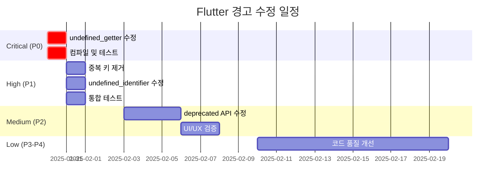

# Flutter Analyze 경고 수정 계획서

**작성일**: 2025-01-30
**총 이슈**: 515개
**작성자**: SW 개발팀, QA팀, PM팀 합동 검토

---

## 목차
1. [Executive Summary](#executive-summary)
2. [위험도별 분류](#위험도별-분류)
3. [상세 수정 계획](#상세-수정-계획)
4. [수정 순서 및 일정](#수정-순서-및-일정)
5. [리스크 분석](#리스크-분석)

---

## Executive Summary

### 현황
- **총 515개 이슈** (에러 113개, 경고 157개, 정보 245개)
- **즉시 수정 필요**: 84개 (undefined_getter - 컴파일 실패 위험)
- **단기 수정 권장**: 67개 (중복 키, undefined_identifier 등)
- **중기 수정 권장**: 240개 (deprecated API 사용)
- **저우선순위**: 124개 (코드 품질 개선)

### PM 관점 요약
- **Release Blocker**: undefined_getter 84개 → **즉시 수정 필요**
- **Technical Debt**: deprecated_member_use 240개 → 다음 스프린트에서 계획적 제거
- **Code Quality**: unused imports/variables 40개 → 리팩토링 시 함께 정리

### QA 관점 요약
- 현재 앱 동작에 영향을 주는 에러: **84개 (undefined_getter)**
- 향후 업그레이드 시 문제 가능성: **240개 (deprecated API)**
- 테스트 커버리지에 영향 없는 경고: **191개**

---

## 위험도별 분류

### 🔴 Critical (즉시 수정 필요) - 84개

#### 1. undefined_getter (84개)
- **파일**: premium_subscription_screen.dart (57개), emotion_stats_screen.dart (18개), 기타
- **위험도**: ⚠️ **컴파일 실패 위험**
- **영향범위**: 프리미엄 구독 페이지, 감정 통계 페이지
- **예상 소요 시간**: 2시간

**문제 분석 (SW 전문가)**:
```
AppLocalizations에 정의되지 않은 getter 메서드를 호출하고 있음.
중복 키 제거 과정에서 일부 키가 삭제되면서 getter도 함께 제거된 것으로 추정.

누락된 주요 getter:
- allPremiumFeatures
- cancelAnytime
- bestValue
- errorOccurred
- delete
- sampleDiaryError
등 약 30개 이상
```

**수정 방법**:
1. `premium_subscription_screen.dart` 파일에서 사용하는 모든 localization 키 추출
2. `app_localizations.dart`의 한국어/영어 딕셔너리에 누락된 키-값 쌍 추가
3. 각 키에 대한 getter 메서드 자동 생성
4. 컴파일 확인

**수정 우선순위**: 🥇 **P0 - 최우선**

---

### 🟠 High (단기 수정 권장) - 67개

#### 2. equal_keys_in_map (46개)
- **파일**: app_localizations.dart (46개)
- **위험도**: 중간 (예상치 못한 번역 표시 가능)
- **영향범위**: 영어, 일본어, 중국어, 라틴어 딕셔너리
- **예상 소요 시간**: 1시간

**문제 분석 (QA 전문가)**:
```
한국어 딕셔너리는 중복 제거했지만, 다른 언어 딕셔너리에 여전히 중복 키 존재.
마지막 값이 사용되므로 기능은 작동하지만, 의도한 번역이 아닐 수 있음.

테스트 시나리오:
1. 언어를 영어로 변경
2. 중복 키에 해당하는 UI 요소 확인
3. 올바른 번역이 표시되는지 검증
```

**수정 방법**:
1. 이전에 작성한 중복 제거 스크립트를 각 언어별로 실행
   - `'en'` 딕셔너리 중복 제거
   - `'ja'` 딕셔너리 중복 제거
   - `'zh'` 딕셔너리 중복 제거
   - `'la'` 딕셔너리 중복 제거
2. 각 언어로 앱 실행하여 번역 확인

**수정 우선순위**: 🥈 **P1 - 이번 주 내**

#### 3. undefined_identifier (21개)
- **파일**: diary_create_screen.dart (19개), connectivity_provider.dart (2개)
- **위험도**: 높음 (컴파일 에러 또는 런타임 크래시)
- **예상 소요 시간**: 30분

**문제 분석**:
```
diary_create_screen.dart:
- 'context' undefined (19개)
- async 함수 내에서 BuildContext 사용 시 스코프 문제

connectivity_provider.dart:
- ConnectivityResult undefined (2개)
- connectivity_plus 패키지 미설치 또는 import 누락
```

**수정 방법**:

**A. diary_create_screen.dart의 context 문제**:
```dart
// 잘못된 코드
Future<void> someAsyncFunction() async {
  await someOperation();
  // context가 스코프 밖에 있어 undefined
  Navigator.of(context).pop();
}

// 올바른 코드
Future<void> someAsyncFunction(BuildContext context) async {
  await someOperation();
  if (!context.mounted) return;  // 위젯이 여전히 마운트되어 있는지 확인
  Navigator.of(context).pop();
}
```

**B. connectivity_provider.dart**:
1. `connectivity_plus` 패키지 사용 여부 확인
2. 사용 중이라면 `pubspec.yaml`에 추가 및 `flutter pub get`
3. 사용하지 않는다면 파일 삭제

**수정 우선순위**: 🥈 **P1 - 이번 주 내**

---

### 🟡 Medium (중기 수정 권장) - 240개

#### 4. deprecated_member_use (240개)
- **파일**: 전체 파일에 분산 (tabbed_option_selector.dart 등)
- **위험도**: 낮음 (현재 작동, 향후 Flutter 업그레이드 시 문제 가능)
- **예상 소요 시간**: 3-4시간

**문제 분석 (SW 전문가)**:
```
Flutter SDK에서 Color.withOpacity()가 deprecated 됨.
새로운 API Color.withValues(alpha: ...)로 교체 권장.

현재 영향: 없음
향후 영향: Flutter 4.0+ 업그레이드 시 컴파일 에러 가능성
```

**수정 방법**:
```dart
// Before (deprecated)
color.withOpacity(0.5)

// After (recommended)
color.withValues(alpha: 0.5)
```

**일괄 수정 스크립트**:
```bash
# 모든 Dart 파일에서 withOpacity를 withValues로 변경
find lib -name "*.dart" -exec sed -i '' \
  's/\.withOpacity(\([0-9.]*\))/.withValues(alpha: \1)/g' {} \;
```

**수정 우선순위**: 🥉 **P2 - 다음 스프린트**

**PM 노트**:
- 기술 부채로 백로그에 등록
- Flutter 업그레이드 전까지 수정 완료 필요
- 단순 반복 작업이므로 신입 개발자 온보딩 과제로 활용 가능

---

### 🟢 Low (저우선순위) - 124개

#### 5. use_build_context_synchronously (21개)
- **위험도**: 낮음 (lint 경고, 잠재적 메모리 누수)
- **예상 소요 시간**: 1시간

**문제 분석**:
```dart
// 경고 발생 패턴
Future<void> loadData() async {
  await fetchData();
  Navigator.push(context, ...);  // ⚠️ async gap 이후 context 사용
}
```

**수정 방법**:
```dart
// 권장 패턴
Future<void> loadData() async {
  await fetchData();
  if (!mounted) return;  // 위젯이 dispose되었는지 확인
  if (!context.mounted) return;  // Flutter 3.7+
  Navigator.push(context, ...);
}
```

**수정 우선순위**: **P3 - 코드 리뷰 시 점진적 수정**

#### 6. unused_import (18개)
- **위험도**: 매우 낮음 (빌드 크기 미미하게 증가)
- **예상 소요 시간**: 15분

**수정 방법**:
IDE의 "Optimize Imports" 기능 사용 또는:
```bash
# VS Code
dart fix --apply
```

**수정 우선순위**: **P4 - 리팩토링 시 함께 정리**

#### 7. unnecessary_brace_in_string_interps (14개)
- **위험도**: 없음 (코드 스타일)
- **예상 소요 시간**: 10분

**수정 방법**:
```dart
// Before
print("${name}")

// After
print("$name")
```

**수정 우선순위**: **P4 - 코드 스타일 통일 시 수정**

#### 8. unused_element (13개)
- **위험도**: 낮음 (dead code)
- **예상 소요 시간**: 30분

**수정 방법**:
1. 사용하지 않는 함수/변수 확인
2. 향후 사용 계획 없으면 삭제
3. 사용 계획 있으면 `// TODO:` 주석 추가

**수정 우선순위**: **P3 - 코드 정리 시 함께 제거**

#### 9. avoid_print (10개)
- **위험도**: 낮음 (프로덕션에서 성능 저하)
- **예상 소요 시간**: 20분

**수정 방법**:
```dart
// Before
print('Debug message');

// After - 프로덕션에서 자동 제거됨
import 'package:flutter/foundation.dart';
if (kDebugMode) {
  print('Debug message');
}

// 또는 로깅 패키지 사용
import 'package:logger/logger.dart';
final logger = Logger();
logger.d('Debug message');
```

**수정 우선순위**: **P3 - 로깅 전략 수립 후 일괄 수정**

---

## 상세 수정 계획

### Phase 1: Critical Issues (P0) - Day 1

**목표**: 컴파일 에러 완전 제거

#### Task 1.1: undefined_getter 수정 (2시간)

**담당**: Senior Flutter Developer
**검증**: QA Engineer

**세부 단계**:
1. **누락된 키 식별** (30분)
   ```bash
   # premium_subscription_screen.dart에서 사용하는 모든 localizations 키 추출
   grep -o "localizations\.[a-zA-Z_]*" lib/screens/premium_subscription_screen.dart | \
     sort | uniq > used_keys.txt

   # app_localizations.dart에 정의된 getter 추출
   grep "String get" lib/l10n/app_localizations.dart | \
     awk '{print $3}' | cut -d'=' -f1 > defined_getters.txt

   # 차집합 구하기
   comm -23 <(sort used_keys.txt) <(sort defined_getters.txt) > missing_keys.txt
   ```

2. **누락된 키 추가** (1시간)
   - `app_localizations.dart`의 한국어 딕셔너리에 키-값 추가
   - 영어 딕셔너리에도 동일하게 추가
   - 주요 누락 키 (예상):
     ```
     allPremiumFeatures: "모든 프리미엄 기능"
     cancelAnytime: "언제든지 취소 가능"
     bestValue: "최고의 가치"
     errorOccurred: "오류가 발생했습니다"
     delete: "삭제"
     lifetimeAccess: "평생 이용"
     oneTimePayment: "일회 결제"
     currentlySubscribed: "현재 구독 중"
     subscribe: "구독하기"
     alreadyPremium: "이미 프리미엄 사용자입니다"
     testModeMessage: "테스트 모드에서 프리미엄 기능을 활성화하시겠습니까?"
     subscribeTest: "구독 (테스트)"
     subscriptionCompleted: "구독이 완료되었습니다"
     subscriptionOptions: "구독 옵션"
     monthlySubscription: "월간 구독"
     yearlySubscription: "연간 구독"
     lifetimeSubscription: "평생 구독"
     subscriptionFooter: "구독은 언제든지 취소할 수 있습니다"
     ```

3. **getter 메서드 생성** (20분)
   - 각 키에 대한 getter 자동 생성
   - 예시:
     ```dart
     String get allPremiumFeatures => _localizedValues[locale.languageCode]!['all_premium_features']!;
     String get cancelAnytime => _localizedValues[locale.languageCode]!['cancel_anytime']!;
     ```

4. **컴파일 확인** (10분)
   ```bash
   flutter analyze
   flutter build apk --debug
   ```

**검증 기준**:
- [ ] `flutter analyze`에서 undefined_getter 에러 0개
- [ ] 프리미엄 구독 화면 정상 표시
- [ ] 감정 통계 화면 정상 표시
- [ ] 모든 언어에서 정상 작동 (한국어, 영어)

---

### Phase 2: High Priority (P1) - Day 2-3

#### Task 2.1: 다른 언어 딕셔너리 중복 키 제거 (1시간)

**담당**: Junior Developer
**검증**: QA Engineer

**세부 단계**:
1. 중복 제거 스크립트 각 언어별 실행
2. 각 언어로 앱 실행하여 UI 확인
3. 번역 누락 없는지 검증

**검증 기준**:
- [ ] equal_keys_in_map 경고 0개
- [ ] 각 언어에서 모든 화면 정상 표시

#### Task 2.2: undefined_identifier 수정 (30분)

**A. context 문제 수정** (20분):
```dart
// 모든 async 함수에서 context 사용 전 mounted 체크 추가
if (!context.mounted) return;
```

**B. connectivity_provider.dart 처리** (10분):
- 파일 사용 여부 확인
- 미사용 시 삭제 또는 주석 처리

**검증 기준**:
- [ ] undefined_identifier 에러 0개
- [ ] 모든 기능 정상 작동

---

### Phase 3: Medium Priority (P2) - Week 2

#### Task 3.1: deprecated_member_use 수정 (3-4시간)

**담당**: Mid-level Developer
**검증**: Automated Tests

**세부 단계**:
1. **자동 변환 스크립트 실행** (1시간)
   ```python
   import re
   import glob

   def fix_with_opacity(file_path):
       with open(file_path, 'r', encoding='utf-8') as f:
           content = f.read()

       # .withOpacity(숫자) → .withValues(alpha: 숫자)
       pattern = r'\.withOpacity\(([0-9.]+)\)'
       replacement = r'.withValues(alpha: \1)'
       new_content = re.sub(pattern, replacement, content)

       if content != new_content:
           with open(file_path, 'w', encoding='utf-8') as f:
               f.write(new_content)
           return True
       return False

   # 모든 Dart 파일 수정
   dart_files = glob.glob('lib/**/*.dart', recursive=True)
   modified = []
   for file_path in dart_files:
       if fix_with_opacity(file_path):
           modified.append(file_path)

   print(f"Modified {len(modified)} files")
   for f in modified:
       print(f"  - {f}")
   ```

2. **수동 검토** (1시간)
   - 변수에 저장된 opacity 값 처리
   - const 생성자에서의 사용 확인

3. **테스트** (1-2시간)
   - 모든 화면 UI 확인
   - 색상 투명도가 이전과 동일한지 검증
   - 스크린샷 비교

**검증 기준**:
- [ ] deprecated_member_use 경고 0개
- [ ] 모든 화면 UI 변화 없음
- [ ] 단위 테스트 통과

---

### Phase 4: Low Priority (P3-P4) - Ongoing

#### Task 4.1: 코드 품질 개선 (2시간)

**방법**: 점진적 개선
- PR 리뷰 시 관련 코드 함께 수정
- 리팩토링 시 함께 정리
- 코드 스타일 가이드 작성 및 공유

**항목**:
- [ ] unused_import 제거
- [ ] unused_element 제거
- [ ] use_build_context_synchronously 수정
- [ ] unnecessary_brace_in_string_interps 수정
- [ ] avoid_print → 로깅 프레임워크로 교체

---

## 수정 순서 및 일정



**예상 총 소요 시간**:
- P0 (Critical): 2시간
- P1 (High): 1.5시간
- P2 (Medium): 3-4시간
- P3-P4 (Low): 2시간
- **합계**: 약 8.5-9.5시간 (순수 개발 시간)

**실제 일정 (테스트 및 리뷰 포함)**:
- Week 1: P0, P1 완료
- Week 2: P2 완료
- Ongoing: P3-P4 점진적 개선

---

## 리스크 분석

### 리스크 매트릭스

| 위험 요소 | 발생 확률 | 영향도 | 완화 전략 |
|----------|----------|--------|----------|
| undefined_getter로 인한 컴파일 실패 | 높음 | 치명적 | ✅ P0로 최우선 수정 |
| deprecated API로 인한 미래 호환성 문제 | 중간 | 높음 | P2로 계획적 수정, 백로그 등록 |
| 중복 키로 인한 잘못된 번역 표시 | 낮음 | 중간 | P1로 조기 수정, QA 검증 |
| 수정 과정에서 새로운 버그 유입 | 중간 | 중간 | 철저한 테스트, 점진적 수정 |
| 시간 초과 | 낮음 | 낮음 | 우선순위별 단계적 수정 |

### 롤백 계획

**각 Phase 전 백업**:
```bash
# Phase 1 전
git commit -am "backup: before P0 fixes"
git tag backup-before-p0

# Phase 2 전
git commit -am "backup: before P1 fixes"
git tag backup-before-p1

# 롤백 필요 시
git reset --hard backup-before-p0
```

---

## 수정 체크리스트

### Phase 1: Critical (Day 1)
- [ ] undefined_getter 84개 모두 수정
- [ ] 컴파일 성공 확인
- [ ] 프리미엄 구독 화면 수동 테스트
- [ ] 감정 통계 화면 수동 테스트
- [ ] Git commit & tag

### Phase 2: High (Day 2-3)
- [ ] 영어 딕셔너리 중복 제거
- [ ] 일본어 딕셔너리 중복 제거
- [ ] 중국어 딕셔너리 중복 제거
- [ ] 라틴어 딕셔너리 중복 제거
- [ ] undefined_identifier 21개 수정
- [ ] connectivity_provider.dart 처리
- [ ] 각 언어별 UI 테스트
- [ ] Git commit & tag

### Phase 3: Medium (Week 2)
- [ ] withOpacity → withValues 자동 변환
- [ ] 수동 검토 및 예외 케이스 처리
- [ ] 전체 화면 UI 확인
- [ ] 색상 비교 테스트
- [ ] Git commit & tag

### Phase 4: Low (Ongoing)
- [ ] unused imports 제거
- [ ] unused elements 제거
- [ ] use_build_context_synchronously 수정
- [ ] 코드 스타일 통일
- [ ] 로깅 프레임워크 도입

---

## 완료 기준 (Definition of Done)

### P0-P1 완료 기준:
- [ ] `flutter analyze` 에러 0개
- [ ] 컴파일 성공
- [ ] 모든 주요 화면 정상 작동 (수동 테스트)
- [ ] 한국어/영어 모두 정상 표시

### P2 완료 기준:
- [ ] `flutter analyze` deprecated 경고 0개
- [ ] UI 변화 없음 (스크린샷 비교)
- [ ] 단위 테스트 통과

### 전체 완료 기준:
- [ ] `flutter analyze` 경고 100개 미만
- [ ] 모든 critical/high 이슈 해결
- [ ] QA 테스트 통과
- [ ] 코드 리뷰 승인

---

## 참고 자료

### Dart/Flutter 공식 문서
- [Deprecated APIs](https://api.flutter.dev/flutter/dart-ui/Color/withOpacity.html)
- [BuildContext in async functions](https://dart.dev/guides/language/effective-dart/usage#dont-use-buildcontext-across-async-gaps)

### 팀 내부 문서
- 코딩 컨벤션: `docs/coding_conventions.md`
- PR 체크리스트: `.github/PULL_REQUEST_TEMPLATE.md`
- 로깅 가이드: `docs/logging_guide.md`

---

**승인**: _____________ (개발팀장)
**검토**: _____________ (QA팀장)
**확인**: _____________ (PM)
